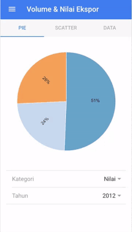
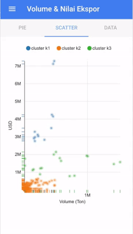

# This app will move to react-native!! so this repo is unmaintained.

# Batavia

Inspired by GNU and PHP name, "Batavia" stands for "Batavia Visualization App" a dynamic mobile visualization app for Jakarta open data (Ekonomi and Keuangan Daerah for now).

### How to Install on PC
```
> npm install -g cordova
> npm install -g ionic@beta
> npm install
```

### Serve on Browser
```
> ionic serve --lab
```

### Build on Android
```
> ionic run android
```

### Build on iOS
```
> ionic build ios
> ionic emulate ios --[target]
```

Where target are:

```
iPhone-4s
iPhone-5
iPhone-5s
iPhone-6-Plus
iPhone-6
iPad-2
iPad-Retina
iPad-Air
Resizable-iPhone
Resizable-iPad
```

For example run on iPhone-6:
```
> ionic emulate ios --target="iPhone-6s"
```

To find out available emulations I run this (thanks to [johnparn](https://github.com/driftyco/ionic-cli/issues/317#issuecomment-120518354)):
```
> ios-sim showdevicetypes
```

### Demo

<div style="display:inline">




</div>

### License
MIT (2016)
